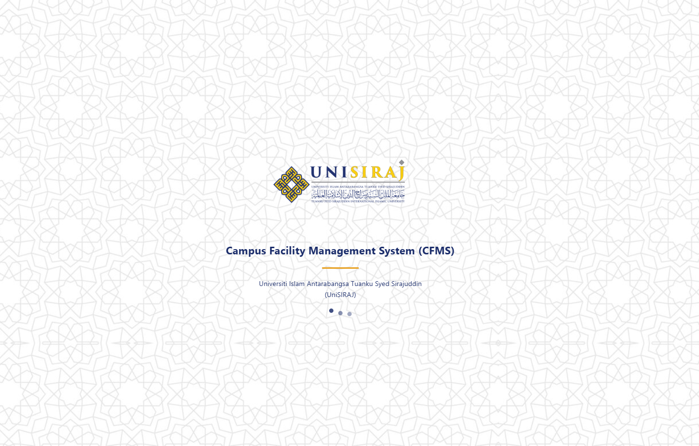
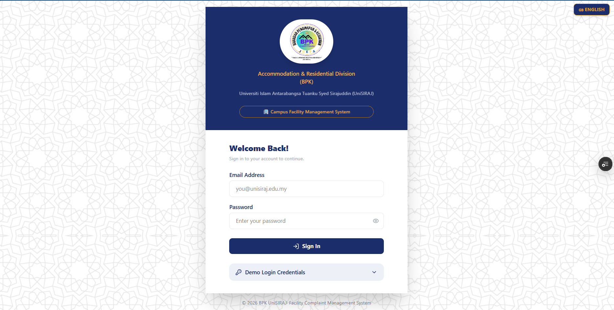
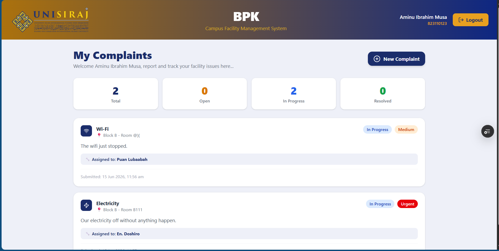
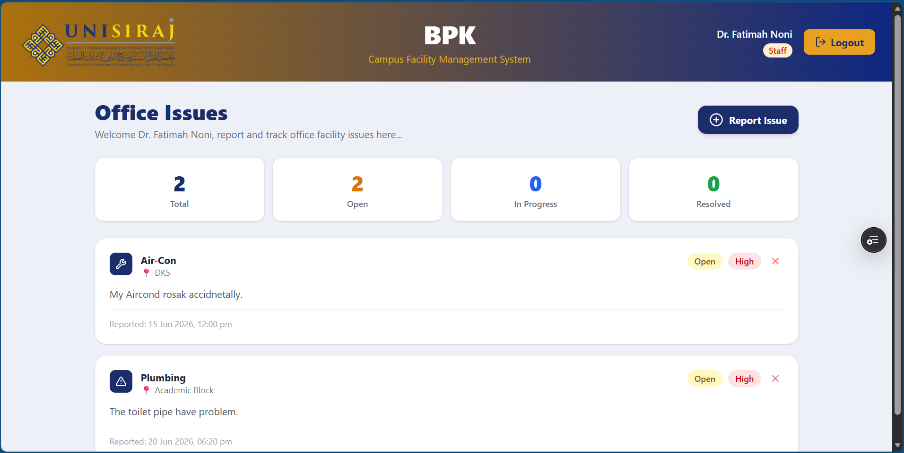
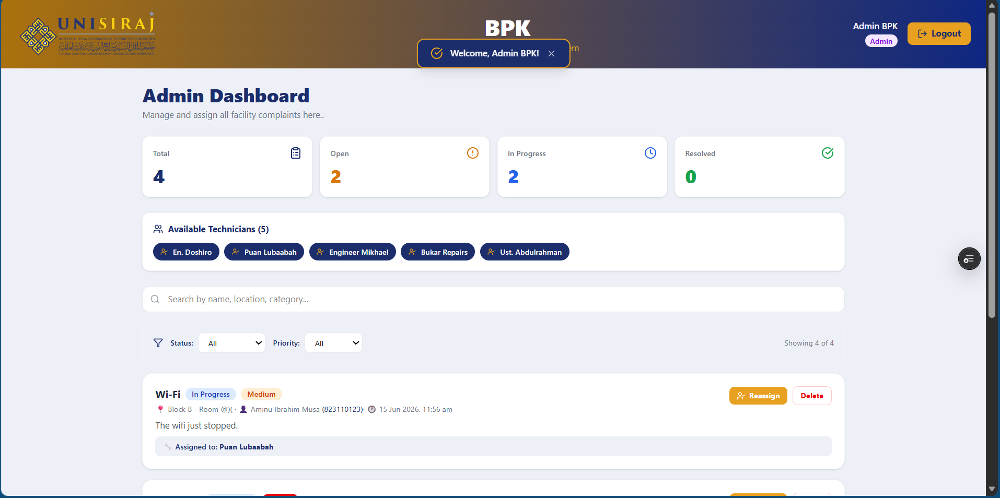
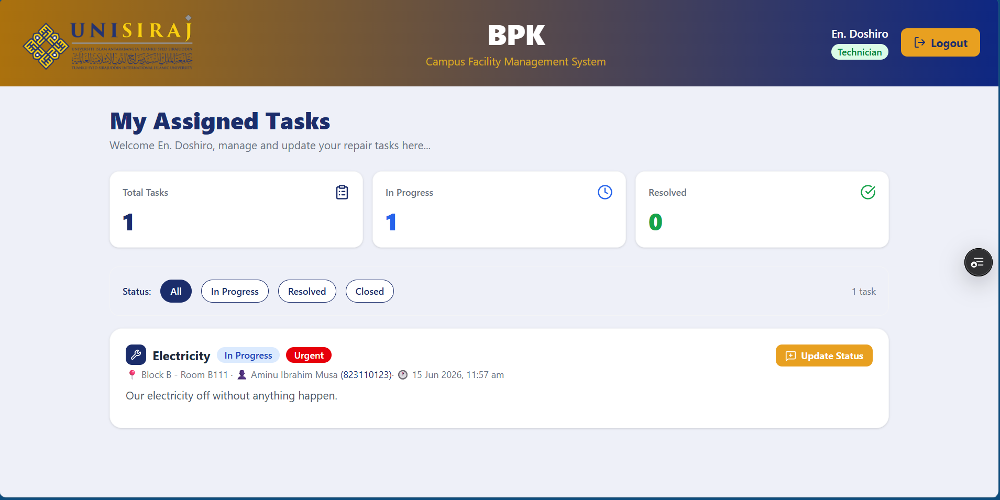
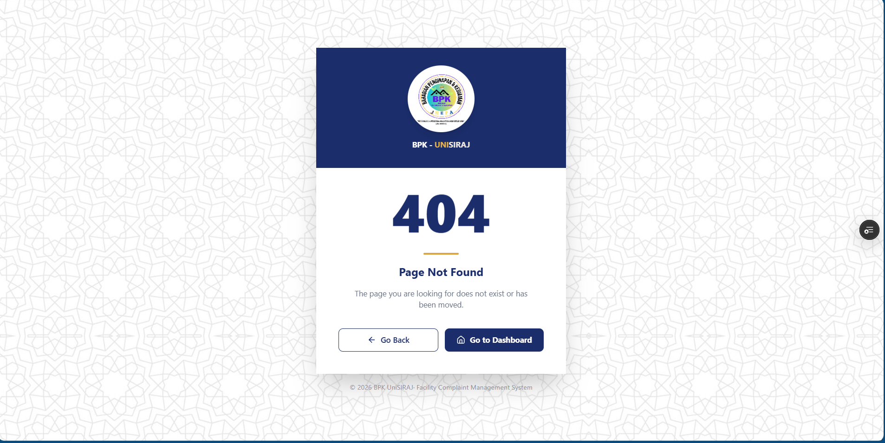

<div align="center">

# 🏢 BPK UniSIRAJ
## Campus Facility Complaint Management System

[](https://unisiraj-bpk-campus-facility.vercel.app)
[](https://github.com/Mataxuh/Unisiraj-bpk-campus-facility)

</div>

---

## 📋 About The Project

The **BPK Campus Facility Complaint Management System** is a Progressive Web Application (PWA) developed for **Bahagian Penginapan & Kediaman (BPK)** at **Universiti Islam Antarabangsa Tuanku Syed Sirajuddin (UniSIRAJ)**.

This system digitally transforms the facility complaint management process — replacing manual paper-based reporting with a modern role-based web application.

---

## 🌐 Live Demo

🔗 **[https://unisiraj-bpk-campus-facility.vercel.app](https://unisiraj-bpk-campus-facility.vercel.app)**

### 🔑 Demo Credentials

| Role | Email | Password |
|---|---|---|
| 👨‍🎓 Student | student@unisiraj.edu.my | student123 |
| 👔 Staff | staff@unisiraj.edu.my | staff123 |
| ⚙️ Admin | admin@unisiraj.edu.my | admin123 |
| 🔧 Technician | tech@unisiraj.edu.my | tech123 |

---

## 📱 Screenshots

### Splash Screen


### Login Page


### Student Dashboard


### Staff Dashboard


### Admin Dashboard


### Technician Dashboard


### 404 Page


---

## ✨ Key Features

- ✅ Role-based access control (4 roles)
- ✅ Dual language support (English & Bahasa Malaysia)
- ✅ PWA — installable as mobile/desktop app
- ✅ Fully responsive (mobile & desktop)
- ✅ Real-time notifications
- ✅ Complaint priority system (Low/Medium/High/Urgent)
- ✅ Search & filter functionality (Admin)
- ✅ Technician notes & update history
- ✅ Splash screen with UniSIRAJ branding
- ✅ 404 error page with animation
- ✅ Offline capability via Service Worker

---

## 👥 User Roles

### 👨‍🎓 Student
- Submit facility complaints
- Track complaint status in real-time
- View technician updates & notes
- Delete open complaints

### 👔 Staff
- Report office-related facility issues
- Track issue resolution progress
- View assigned technician details

### ⚙️ Admin
- View ALL complaints from ALL users
- Filter by status & priority
- Search complaints
- Assign & reassign technicians
- Delete any complaint

### 🔧 Technician
- View personally assigned tasks only
- Update repair status
- Add progress notes
- View full update history

---

## 🔄 Complaint Workflow
1️⃣  Student/Staff submits complaint

↓

2️⃣  Admin assigns to technician

↓

3️⃣  Status → "In Progress"

↓

4️⃣  Technician updates & adds notes

↓

5️⃣  Student/Staff sees updates

↓

6️⃣  Complaint → "Resolved" or "Closed"


---

## 🛠️ Tech Stack

| Technology | Purpose |
|---|---|
| **React.js** | Frontend UI framework |
| **Vite** | Build tool & dev server |
| **Tailwind CSS v4** | Styling & responsive design |
| **React Router v6** | Page navigation |
| **LocalStorage** | Data persistence |
| **Lucide React** | Icons |
| **PWA** | Installable web app |
| **Vercel** | Hosting & deployment |
| **GitHub** | Version control |

---

## 🚀 Getting Started

```bash
# Clone the repository
git clone https://github.com/Mataxuh/Unisiraj-bpk-campus-facility.git

# Navigate to project folder
cd Unisiraj-bpk-campus-facility

# Install dependencies
npm install

# Start development server
npm run dev
```

---

## 🔮 Future Enhancements

| # | Enhancement | Impact |
|---|---|---|
| 1 | **Real Database** (Firebase/Supabase) | Cross-device data sharing ⭐⭐⭐⭐⭐ |
| 2 | **Email & Push Notifications** | Better communication ⭐⭐⭐⭐⭐ |
| 3 | **Analytics Dashboard** | Data-driven decisions ⭐⭐⭐⭐⭐ |
| 4 | **Photo Attachments** | Better documentation ⭐⭐⭐⭐ |
| 5 | **Rating & Feedback System** | Service quality tracking ⭐⭐⭐⭐ |

---

## ⚠️ Known Limitations

- Data stored in localStorage (device-specific)
- No cross-device real-time data sharing
- Best demonstrated on a single device
- No email notifications (future enhancement)

---

## 👨‍💻 Team

| Name | Role |
|---|---|
| **Muhammad Mataxuh** | Lead Developer & Designer |
| **Auwal Lawal Ibrahim** | Team Member |
| **Aminu Ibrahim Musa** | Team Member |
| **Claude AI (Anthropic)** | Development Assistant |
---

## 📂 Project Structure
campus-facility/

├── public/

│   ├── logo.png

│   ├── bpk-logo.png

│   ├── icon192.png

│   ├── icon512.png

│   ├── background_login.jpg

│   ├── manifest.json

│   └── sw.js

├── screenshots/

│   ├── splash.png

│   ├── login.png

│   ├── student.png

│   ├── staff.png

│   ├── admin.png

│   ├── technician.png

│   └── 404.png
├── src/

│   ├── components/

│   │   ├── LanguageToggle.jsx

│   │   ├── Navbar.jsx

│   │   ├── Notification.jsx

│   │   └── SplashScreen.jsx

│   ├── context/

│   │   ├── AppContext.jsx

│   │   └── LanguageContext.jsx

│   ├── pages/

│   │   ├── AdminPage.jsx

│   │   ├── LoginPage.jsx

│   │   ├── NotFoundPage.jsx

│   │   ├── StaffPage.jsx

│   │   ├── StudentPage.jsx

│   │   └── TechnicianPage.jsx
│   ├── translations/

│   │   └── index.js

│   ├── utils/

│   │   └── storage.js

│   ├── App.jsx

│   ├── index.css

│   └── main.jsx

├── index.html

├── vercel.json

└── vite.config.js

---

<div align="center">

**© 2026 BPK UniSIRAJ · Campus Facility Management System**

Made with Cinta for UniSIRAJ BPK - UniSIRAJ di hati!

</div>